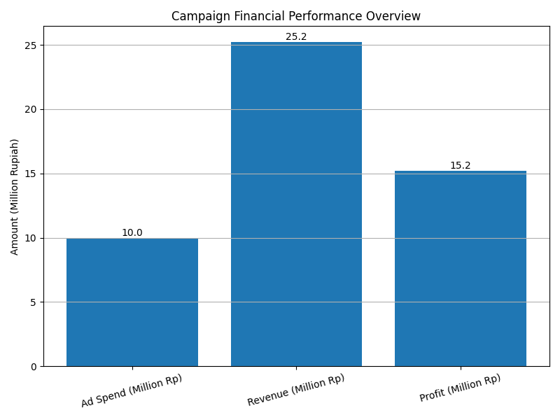

## 💰 Financial Performance Visualization

  

# Marketing Campaign Performance Case Study

## 📌 Campaign Overview

**Brand:** GlowSkin (Fictional Brand)  
**Objective:** Increase online sales  
**Channel:** Instagram Ads & TikTok Ads  
**Budget:** Rp 10.000.000  
**Duration:** 30 Days  

---

##  Target Audience

- Women aged 18–30  
- Interested in skincare & beauty  
- Active on Instagram & TikTok  

---

##  Campaign Results

| Metric | Result |
|--------|--------|
| Reach | 120,000 |
| Clicks | 8,500 |
| CTR | 7.08% |
| Conversions | 420 Sales |
| Cost per Conversion | Rp 23,800 |
| Revenue | Rp 25,200,000 |
| ROI | 152% |

---

##  Key Insights

- TikTok Ads generated higher CTR compared to Instagram.
- Conversion rate improved after optimizing landing page CTA.
- Retargeting audience contributed 35% of total sales.

---

##  Optimization Strategy

1. Increase budget allocation to high-performing TikTok ads.
2. Improve landing page loading speed.
3. Implement email retargeting funnel.
4. A/B test new creative variations.

---

## 💡 Conclusion

This case study demonstrates how structured KPI tracking and performance evaluation can significantly improve marketing ROI through data-driven optimization.
